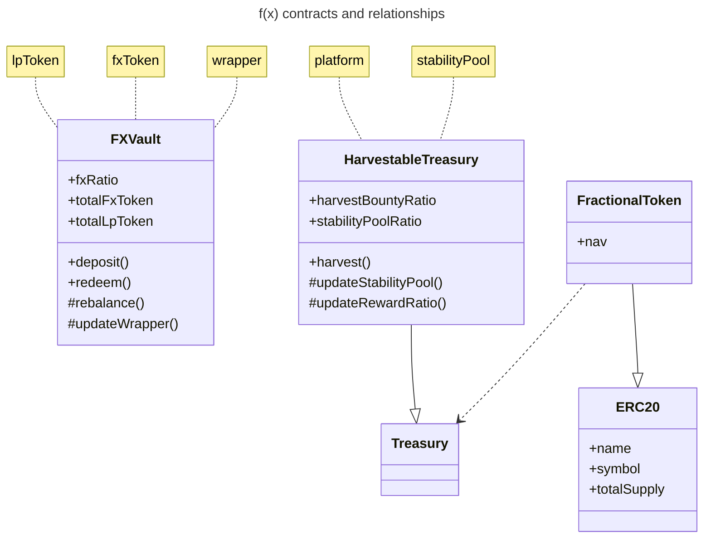
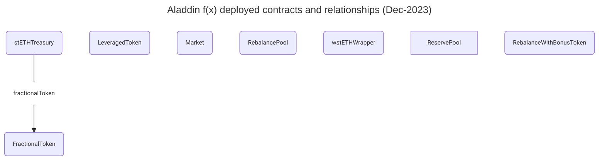

# Aladdin DAO F(x) Contracts

### What is Concentrator?

Concentrator is a yield enhancement product by AladdinDAO built for smart farmers who wish to use their Convex LP assets to farm top-tier DeFi tokens (CRV, CVX) at the highest APY possible. Increase your yields on Convex farms by the CRV staking pool APY.

### How does it work?

Farmers deposit their Convex vault LP tokens in Concentrator. Yields from those vaults are harvested, swapped to CRV and then staked on behalf of the farmer in the Convex CRV vault where they autocompound. Users may withdraw any or all of their deposit and yield at any time in CRV or (zap to) CVX!

### Is it an autocompounder?

An autocompounder generally sells all farming rewards for a vault in order to buy more of the deposited token. The APY is generated by compounding the base rate, but the base rate for the yield is the same as that for the bulk deposit. Gains are realized continuously rather than at a time chosen by the farmer.

Concentrator can capture rewards from deposits in multiple different Convex vaults and merge them into CRV where they take advantage of the high CRV staking rate on Convex. Yields auto-compound at this higher rate, denominated in a top-tier DeFi token (CRV) and gains can be realized/claimed in CRV or CVX at a time chosen by the farmer for maximum tax advantage.

### Is it safe?

Concentrator is built by the experienced and security-obsessed AladdinDAO team, and it is audited by SECBIT Labs.

Check out the audit [here](./audit-reports/SECBIT_Concentrator_Report.pdf).

## Development

### install dependency

install yarn

```
yarn install
```

### compile contract

```
yarn hardhat compile
```

### unit test

```
yarn hardhat test
```

### visual studio code

add the following extensions:

- Markdown Preview Mermaid Support (for the diagrams in readme.md)
- vscode-pdf (to see the whitepapers)
- Solidity (nomic foundation one)

## Contract relationships



## Deployment

see: [Deployments](https://github.com/AladdinDAO/deployments).



"stETHGateway": "0x9bF5fFABbF97De0a47843A7Ba0A9DDB40f2e2ed5",
"ChainlinkTwapOracle": {
"ETH": "0x460B3CdE57DfbA90DBed02fd83d3990a92DA1230",
"stETH": "0xD24AC180e6769Fd5F624e7605B93084171074A77"
},
"FxETHTwapOracle": "0xa84360896cE9152d1780c546305BB54125F962d9",
"FxGateway": "0x49e51067E695bd79d6275eCaB6E9E527a72AbdE4",
"ReservePool": "0x5d0Aacf75116d1645Db2B3d1Ca4b303ef0CA3752",
"RebalanceWithBonusToken": "0x17f21f468d77E6e35702a9Ae7a9da50Db7F6a4f4"
}
